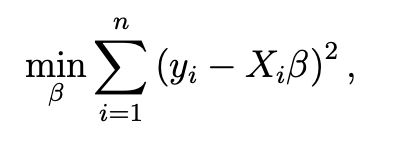
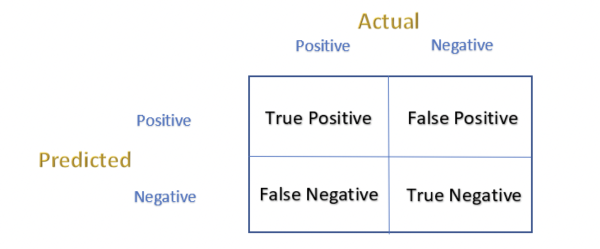

# ML-lab notes

## Data Preprocessing

Data Preprocessing is a Data Mining technique that involves transforming raw data into an understandable format. Real-world data tend to be incomplete, noisy, and inconsistent. This can lead to a poor quality of collected data and further to a low quality of models built on such data. In order to address these issues, Data Preprocessing provides operations which can organise the data into a proper form for better understanding. The techniques used in Data Preprocessing are:

1. **Data Cleaning**: Data Cleaning/Cleansing routines attempt to fill in missing values, smooth out noise while identifying outliers, and correct inconsistencies in the data.

2. **Dimensional Reduction**: Dimensional reduction techniques reduce the dimensionality of the data. It is concerned with reducing the number of input features in training data.

3. **Feature Engineering**: Feature engineering techniques are used to create new features from existing features. E.g. - decomposing categorical attributes from your dataset.

4. **Data Integration**: Data Integration is the process of combining data from different sources to form a single dataset.

5. **Data Transformation**: Data Transformation is the process of transforming data into a new form. Some of the main techniques used to deal with this issue are:

   - **Transformation for categorical variables**: Transformation for categorical variables is the process of converting categorical variables into numeric encodings.

   - **Min-Max Scaler / Normalization**: The min-max scaler, also known as normalization, is one of the most common scalers and it refers to scaling the data between a predefined range (usually between 0 and 1).

   - **Standard Scaler / Standardization**: The standard scaler, also known as standardization, is another common scaler and it refers to scaling the data to have a mean of 0 and a standard deviation of 1.

   - **Other Scalers**: Some other scalers are maxAbsScaler, robust scaler, power transformer, etc.

6. **Handling Data with Unequal Distribution of Classes**: There are three main techniques that we can use to address this deficiency in the dataset:

   - **Over-sampling**: Over-sampling is the process of randomly sampling the data to make it balanced.
   - **Under-sampling**: Under-sampling is the process of randomly sampling the data to make it balanced.
   - **Hybrid**: It combines both over-sampling and under-sampling techniques.

## Linear Regression

Regression exploits the relationship between two or more variables so that we can gain information about one of them through knowing values of the other.

### Simple Linear Regression

We fit a line y = β0 + β1x to our data. Here, x is called the independent variable or predictor variable, and y is called the dependent variable or response variable.

Here,

- β0 is the intercept of the line
- β1 is the slope of the line

We observe paired data points (x1, y1), (x2, y2), . . . , (xn, yn), where we assume that as a func- tion of xi, each yi is generated by using some true underlying line y = β0 + β1x that we evaluate at xi, and then adding some Gaussian noise. Formally,

> yi =β0 + β1xi +εi.

#### Solving for the fit: least-squares regression

It turns out that we can find the line for which the probability of the data is highest by solving the following optimization problem:

The solutions of β0 and β1 are obtained by setting

### Multiple Linear Regression

Here we have n data points (just like before), each with p different predictor variables or features. We’ll then try to predict y for each data point as a linear function of the different x variables:

> y=β1x1 +β2x2 +···+βpxp.

In matrix form it is represented as:

> y = Xβ + ε

Where β is a p-element vector of coefficients, and ε is an n-element matrix where each element, like εi earlier, is normal with mean 0 and variance σ^2.

This leads to the following optimization problem:

We can use some basic linear algebra to solve this problem and find the optimal estimates:

### Polynomial Regression

Regression analysis in which the relationship between the independent variables and dependent variables are modeled in the nth degree polynomial.

This is the general equation of a polynomial regression is:

Y=θo + θ₁X + θ₂X² + … + θₘXᵐ + residual error

### Errors

The error is the difference between the actual value and the predicted value. The types of errors are:

- Mean Absolute Error (MAE)
- Mean Squared Error (MSE)
- Root Mean Squared Error (RMSE)
- Mean Absolute Percentage Error (MAPE)
- Mean Percentage Error (MPE)

#### Mean Absolute Error (MAE)

#### Mean Squared Error (MSE)

#### Mean Absolute Percentage Error (MAPE)

#### Mean Percentage Error (MPE)

### Confusion Matrix

Tt is a matrix comprising instances of predicted and actual events. Its representation is as follows:

The Terms are as follows:

- **True Positive (TP)**: Any positive event that has been correctly predicted.
- **True Negative (TN)**: Any negative event that has been correctly predicted.
- **False Positive (FP)**: Any negative event that has been incorrectly predicted as positive.
- **False Negative (FN)**: Any positive event that has been incorrectly predicted as negative.

Some of the metrics are:

- **Sensitivity**: It is how often did the model predict the positive event correctly. The ratio of correctly predicted positive events to the total positive events. It is given by: TP/(TP+FN).

- **Specificity**: It is how often did the model predict the negative event correctly. The ratio of correctly predicted negative events to the total negative events. It is given by: TN/(TN+FP).

- **False Positive Rate** (1- Specificity): It is How often the model classified negative events as positive. The ratio of incorrectly predicted positive events to the total negative events. It is given by: FP/(FP+TN).

- **Precision**: It is how often the model predicted the event to be positive and it turned out to be true. The ratio of correctly predicted positive events to the total predicted positive events. It is given by: TP/(TP+FP).

- **Accuracy**: It is how often did the model predict the event correctly. The ratio of correctly predicted events to the total events. It is given by: (TP+TN)/(TP+TN+FP+FN).

- **F1 Score**: It is the harmonic mean of precision and recall. It is given by: 2*(Recall * Precision) / (Recall + Precision).

## Logistic Regression

Just like linear regression, it helps you understand the relationship between one or more variables and a target variable, except that, in this case, our target variable is binary: its value is either 0 or 1. have a set of explanatory variables (X1, X2…) and our target binary variable (Y). The probability of your Y being equal to 1, while b0 is a parameter is given as:

Maximum likelihood estimation is used to find the value of the parameter b0 for the model.
